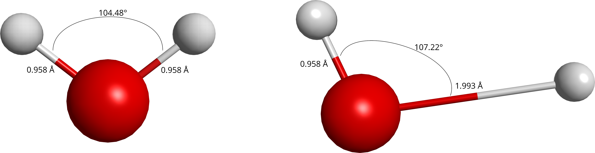

# SPQ-H2O
Ficheiros de input e de resultados para a molécula de água em duas geometrias. A base de funções usada é a base de Dunning, cc-pVDZ. Os cálculos foram efectuados com o programa GAMESS-US 30 SEP 2023 (R2). 
São disponibilizados os cálculos Hartree-Fock, MP2, CCSD(T), CISD, CISDTQ, CISDTQ56 e CISDTQ5678.

